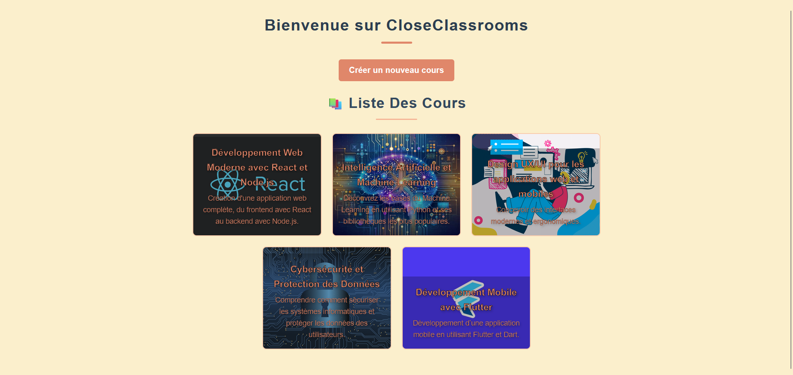
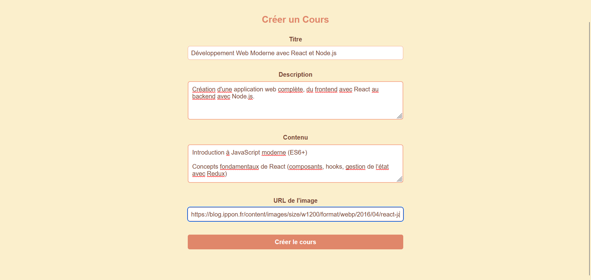
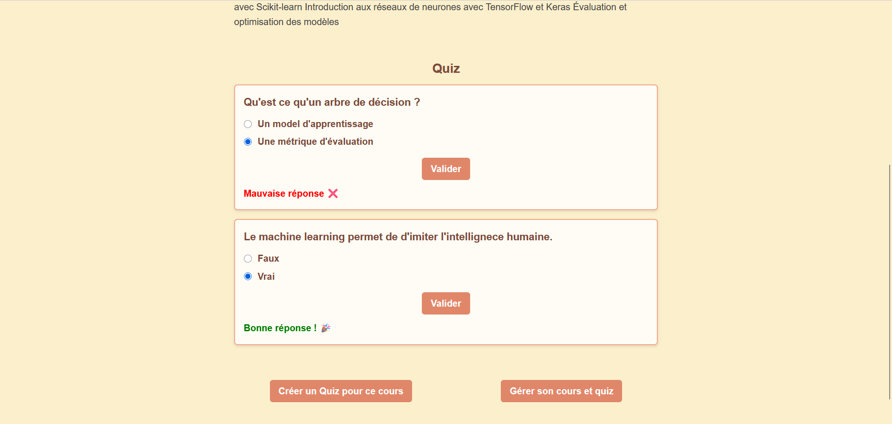
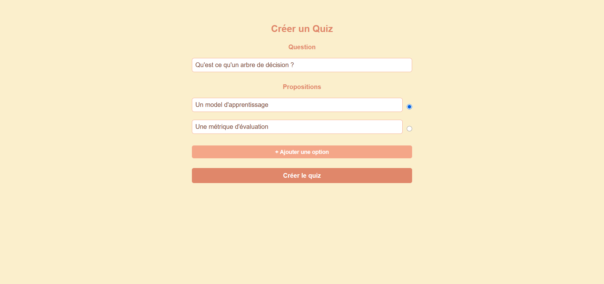
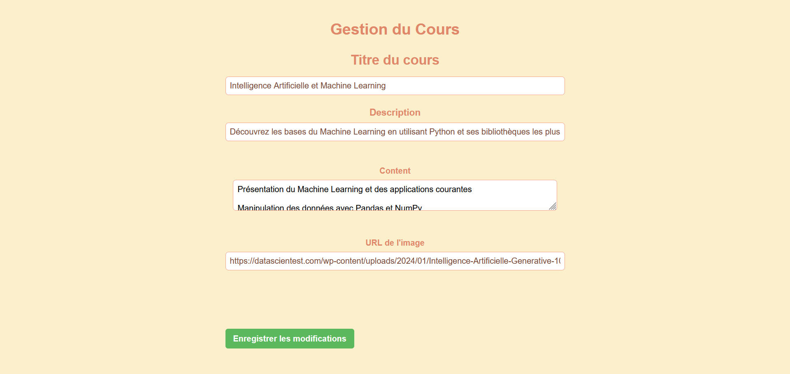
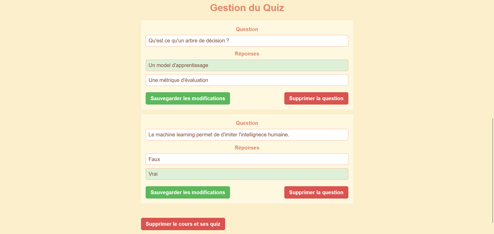

# 🏫 eLearning  

Ce projet est le frontend d'une plateforme d'apprentissage en ligne développée avec **React**. Il permet aux utilisateurs de créer, d'accéder et gérer des cours en ligne.  

## ✨ Fonctionnalités Implémentées  

### 🎓 Gestion des cours  
- Affichage de la liste des cours disponibles  
- Consultation des détails d’un cours (titre, description, contenu, image)

### 📝 Gestion des quiz  
- Intégration de quiz pour évaluer les connaissances des apprenants  
- Questions à choix multiples

### 🎨 Expérience utilisateur optimisée  
- Interface ergonomique et responsive pour une utilisation sur mobile et desktop  
- Utilisation de composants réutilisables pour une navigation fluide  
- Thème moderne avec une hiérarchie visuelle claire  

### 🔗 Intégration API  
- Communication avec un backend via des requêtes **REST API**  
- Récupération dynamique des cours et des quiz  
- Gestion des erreurs et affichage de messages d’information pour l’utilisateur  

## 📌 Technologies utilisées  
- **React.js** – Framework frontend  
- **React Router** – Gestion de la navigation  
- **Axios** – Requêtes HTTP vers l’API backend  
- **CSS Modules** – Gestion du style et design responsive  

## 📷 Aperçus de l'application  

 

## 📜 Licence  
Ce projet est sous licence **MIT**. Consultez le fichier [LICENSE](LICENSE) pour plus d’informations.